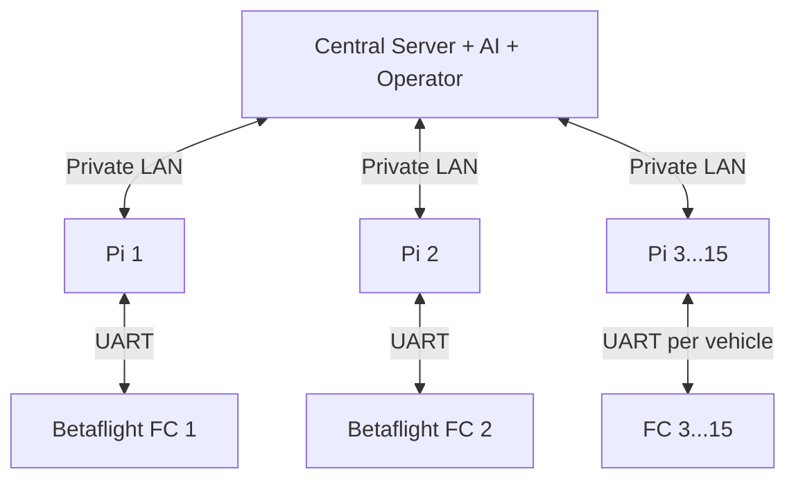

# PRD — AEROLINK Betaflight + Raspberry Pi System

## 1. Product

AEROLINK is a cooperative indoor-delivery fleet prototype with up to 15 registered guarded quadcopters. For a delivery, the central server selects the required subset—for example three drones carrying one shared cable-suspended electromagnet for a 3 kg-class parcel—and manages the mission from a first-floor locker to a second-floor Robotics Lab and back home.

Each drone contains:

- one Betaflight-compatible flight controller;
- one Raspberry Pi companion computer;
- one wired UART connection between them.

The same software image can run on all 15 vehicles using different vehicle IDs. All Raspberry Pis join the same isolated private LAN/WLAN and the delivery system must continue to function without internet access. This PRD covers flight firmware, companion software and central-server software, not mechanical certification.

One central management computer also joins the private network. It runs deterministic fleet management together with an advisory AI layer and an operator interface.

## 2. Goals

- preserve Betaflight's low-level stabilization and safety behavior;
- add a safe external stabilized-control interface over UART;
- run localization, route planning, mission logic and formation coordination on Raspberry Pi;
- manage and observe up to 15 Pi↔FC nodes from one server;
- use AI for structured recommendations and analysis without granting it direct control authority;
- simulate 15 complete Pi↔FC nodes and the server before hardware;
- support observable, deterministic failures and immediate manual takeover;
- keep hardware-specific decisions configurable and documented.

## 3. Non-goals

- direct motor control from Raspberry Pi;
- autonomous arming;
- bypassing Betaflight arming/failsafe;
- SLAM or global planning inside FC firmware;
- assuming one stationary Pi can UART-wire three moving drones;
- immediate 3 kg or occupied-building testing;
- production certification in MVP.

## 4. Topology

The central server is the only mission coordinator in MVP. All 15 vehicle nodes use the same private IPv4 network and require no internet service. Loss of the server triggers a tested bounded degraded/abort policy at every Pi; automatic server election is out of scope initially.

## 5. `flight-controller/` requirements

### FC-1 Upstream baseline

- official Betaflight fork with exact upstream commit/tag recorded;
- confirmed target before any flash;
- reproducible baseline and SITL build;
- no unrelated upstream refactors.

### FC-2 UART endpoint

- versioned framed protocol with integrity, sequence and freshness checks;
- explicit configuration for UART and baud after hardware confirmation;
- parser rejects invalid frames atomically;
- telemetry reports last accepted sequence and rejection reason.

### FC-3 External stabilized mode

- dedicated feature/mode disabled by default;
- setpoint type chosen only after upstream control-path review;
- bounds and slew limits applied;
- accepted commands enter existing Betaflight stabilized paths;
- no direct motor-output message.

### FC-4 Authority and watchdog

- normal arming checks remain active;
- physical/manual disarm and RC takeover have highest authority;
- independent heartbeat and setpoint-age monitoring;
- deterministic logged behavior on UART loss, Pi reboot, stale data and invalid data.

### FC-5 Telemetry/logging

- vehicle/formation ID, mode, command age, watchdog, reject reason, battery, attitude/rates and health;
- Blackbox/debug visibility for new control state and faults;
- CLI status/configuration with safe defaults.

### FC-6 Payload logical interface

- default-off logical state first;
- no real GPIO/driver enabled until board and circuit are reviewed;
- explicit authorization, timeout and feedback/fault states;
- off on boot, reset, disarm and fault by default.

## 6. `raspberry-pi/` requirements

### PI-1 Runtime

- Linux service with explicit configuration per vehicle;
- clean startup/shutdown and hardware-independent development mode;
- structured logs and monotonic timestamps;
- watchdog/health interface to FC and fleet supervisor.

Recommended initial language is Python for rapid simulation and testing, with latency-critical modules eligible for later replacement after measurement.

### PI-2 UART client

- shared protocol implementation and golden test vectors;
- reconnect after FC or Pi restart without arming or applying stale commands;
- bounded transmit queue and receive parser;
- expose link state, latency estimate, errors and command age;
- fake serial transport for tests.

### PI-3 Localization abstraction

- common pose interface independent of sensor choice;
- quality/confidence and timestamp required with every pose;
- reject stale or discontinuous pose estimates;
- simulator adapter included;
- real sensor remains `TBD`.

### PI-4 Mission state machine

Minimum states: `IDLE`, `AUTHORIZED`, `LAUNCH`, `FORM`, `TRANSIT_TO_LOCKER`, `PICKUP`, `TRANSIT_TO_DESTINATION`, `DELIVER`, `RETURN`, `LAND`, `ABORT`, `FAULT`.

Every state defines entry criteria, timeout, expected node health, setpoint source, payload command and abort transition.

### PI-5 Local formation execution

- unique vehicle IDs 1-15;
- execute the assigned formation reference around a virtual carrier point;
- individual position/velocity targets sent only to the matching local FC;
- formation constraints include separation, cable geometry and bounded relative motion;
- one-node fault cannot cause unbounded compensation by the others;
- start with kinematic/SITL models; do not claim validated cable dynamics.

### PI-6 Route planning

- map/room graph interface for Locker F1, stairwell and Robotics Lab F2;
- route and waypoint planner separated from vehicle stabilization;
- corridor/door/stairwell-clearance constraints represented in the map;
- obstacle-avoidance sensor and implementation remain `TBD` behind an interface.

### PI-7 Private fleet network

- all 15 Pi nodes and the central server operate on one isolated LAN/WLAN with configured identities and addresses;
- the application cannot depend on DNS, cloud APIs, internet time or an internet route;
- the central server coordinates mission epoch, group assignment, formation reference and synchronized trajectory segments;
- every Pi publishes state/health and executes only fresh validated server data addressed to its vehicle ID;
- high-rate state traffic uses bounded, expiring datagrams; safety-relevant transitions require explicit acknowledgement/retry;
- messages are versioned and protected against accidental/corrupt or unauthorized injection appropriate to the chosen LAN design;
- central-server loss, excess packet age, jitter and sequence gaps have deterministic non-escalating behavior;
- static identity mapping is authoritative; discovery cannot silently swap drone identities;
- network logs support synchronized replay of all 15 nodes and the server.

### PI-8 Two-hop command validation

A command path is always `central server → private LAN → local Pi → UART → local FC`. Both hops validate version, identity, mission epoch/sequence, age and bounds. A fleet packet never reaches FC motors directly, and the FC accepts commands only from its physically connected local Pi through the guarded UART interface.

## 7. Server requirements

### SV-1 Fleet registry and health

- register up to 15 fixed vehicle identities with capabilities and configuration;
- maintain online/offline/degraded/maintenance/available/assigned states;
- display last contact, pose quality, battery, FC/Pi health, active mission and faults;
- never silently reuse an ID or assign an unhealthy node.

### SV-2 Delivery and fleet allocation

- validate source, destination, payload estimate and requested time;
- filter vehicles deterministically by health, availability, capability and current mission;
- AI may recommend required fleet size, but a rule-based allocator applies configured payload and reserve limits;
- produce a group ID and immutable mission revision before dispatch.

### SV-3 Deterministic mission planner

- plan global route on a versioned building graph;
- reserve shared corridors, stairwell airspace, pickup and drop zones;
- create bounded formation/trajectory segments for the selected group;
- reject route conflicts, stale maps, missing localization quality or insufficient healthy vehicles;
- require operator authorization for real dispatch.

### SV-4 AI assistance boundary

Allowed AI tasks: parse user intent into a proposed structured request, estimate a payload category from approved inputs, recommend fleet size, rank route alternatives, summarize anomalies and generate operator explanations.

Forbidden AI authority: arming, direct setpoints, motor control, payload activation, disabling safety checks, autonomous override of deterministic rejection, or changing an active mission without validated state-machine transition.

All AI responses must use a strict schema, carry model/version and confidence metadata, be logged, and pass deterministic validation. If AI is unavailable or invalid, the core server must fail closed or use a documented non-AI path.

### SV-5 Operator dashboard and audit

- show a 15-node fleet overview, map, active groups, alerts and mission timeline;
- provide authorize, pause/abort request and maintenance controls with role checks;
- log requests, AI proposals, validator decisions, operator actions, commands and acknowledgements;
- support complete offline replay.

### SV-6 Server failure behavior

- nodes detect server loss by expiry, not wall-clock assumption;
- server restart cannot replay an old mission epoch;
- active nodes follow their prevalidated short-horizon degraded/abort policy;
- a recovered server reconciles node state before issuing new commands.

## 8. Shared protocol MVP

Required UART messages:

| Direction | Message | Purpose |
|---|---|---|
| Both | `HELLO/CAPABILITIES` | Version negotiation |
| Pi→FC | `HEARTBEAT` | Companion health |
| Pi→FC | `SET_MODE` | Request guarded external state |
| Pi→FC | `SET_STABILIZED_SETPOINT` | Bounded control reference |
| Pi→FC | `SET_PAYLOAD_STATE` | Guarded logical payload request |
| FC→Pi | `NODE_STATUS` | State and command acknowledgement |
| FC→Pi | `HEALTH` | Battery, link, estimator/control health |
| FC→Pi | `FAULT` | Deterministic fault reporting |
| FC→Pi | `ACK/REJECT` | Application or reason code |

Exact IDs, fields, units, scaling, limits, integrity and timeouts live in `docs/protocol.md` and must be implemented from shared golden vectors.

## 9. Safety behavior

Priority: manual disarm → RC takeover → FC safety → UART watchdog → valid Pi setpoint → mission preference.

No single universal response is assumed for every indoor fault. Each hazard must define whether the controlled result is hover/hold, land, disarm, payload-off or another bounded action, then be verified in simulation before hardware.

The 3 kg target cannot be used for physical testing until propulsion, guards, structure, battery, magnet, cable, thermal limits, test enclosure and supervision are separately reviewed.

## 10. Verification gates

1. unmodified Betaflight baseline and SITL build;
2. protocol unit/fuzz/conformance tests in both folders;
3. FC state-machine and watchdog tests;
4. one Pi process connected to one Betaflight SITL instance;
5. 15 Pi processes and one server on one simulated private LAN, each Pi connected by UART emulation to its own SITL instance;
6. injected UART/LAN latency, jitter, loss, corruption, node restart, server restart/loss and simultaneous node faults;
7. recorded route/formation simulation with no physical hardware;
8. human-approved props-off FC↔Pi UART bench test;
9. separately reviewed guarded physical progression.

Claude may autonomously complete gates 1-7 only.

## 11. MVP milestones

1. create monorepo layout and record upstream baseline;
2. write architecture, hardware matrix and protocol spec;
3. implement protocol libraries plus golden tests;
4. implement FC heartbeat/status/state machine in SITL;
5. implement Pi UART service and fake-FC tests;
6. add FC external stabilized mode and watchdog tests;
7. create single-node end-to-end SITL;
8. implement central server registry, allocator, deterministic planner, AI adapter and dashboard API;
9. create full 15-node server/formation simulation;
10. add subset selection and mission replay for Locker F1→Robotics Lab F2→Home;
11. produce props-off bench-readiness checklist without executing it.

## 12. Acceptance criteria

- repository contains the two required folders and root documentation;
- Betaflight builds normally when AEROLINK is disabled;
- Pi software operates against fake UART and SITL;
- protocol conformance vectors pass in both implementations;
- no packet can arm or directly command motors;
- manual override, UART loss and Pi restart are tested;
- 15 simulated vehicles remain independently identifiable and manageable;
- server loss and multiple-node faults have deterministic logged outcomes;
- AI output cannot bypass deterministic validation or directly control flight/payload outputs;
- hardware facts are evidenced or marked `TBD`;
- no autonomous physical test occurs.

## 13. Blocking hardware decisions

- FC model and exact Betaflight target;
- Raspberry Pi model and OS;
- FC↔Pi UART pins, logic levels and baud;
- RC receiver/manual cutoff;
- indoor localization and obstacle sensors;
- private LAN hardware/access point and final fleet-protocol security configuration;
- propulsion/duct combination;
- carrier tension/load sensing;
- electromagnet driver and release policy.

## 14. Official references

- Betaflight firmware: `https://github.com/betaflight/betaflight`
- Betaflight docs: `https://betaflight.com/docs/`
- Betaflight SITL: `https://betaflight.com/docs/development/SITL`
- Betaflight failsafe: `https://betaflight.com/docs/wiki/guides/current/Failsafe`
