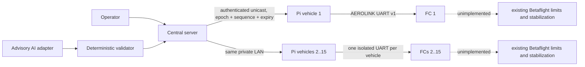

# Architecture

## Deployment

One central management computer and up to 15 vehicle Pis share an isolated
private IPv4 LAN/WLAN. The system has no control-path dependency on DNS,
internet time, cloud APIs, or an internet route. Each Pi has exactly one wired
UART peer: its local Betaflight FC. The server is the sole MVP coordinator;
there is no leader election.

## Trust and authority

The server authenticates a configured Pi identity. A Pi independently checks
protocol version, sender identity, destination vehicle, mission epoch/revision,
sequence, freshness, and numeric bounds before translating an approved local
trajectory reference. The FC then independently checks its UART session,
vehicle ID, sequence, freshness, state, and setpoint bounds. Network packets are
never forwarded byte-for-byte to the FC.

FC authority, highest first, is physical/manual disarm, RC takeover, FC safety,
UART watchdog, valid companion setpoint, then mission preference. No AEROLINK
message arms or directly writes a mixer, ESC, or motor output. Payload hardware
is absent until separately reviewed; its future logical state defaults off.

## Failure containment

- Corrupt, unsupported, oversized, duplicate, or reordered UART frames are
  rejected atomically.
- A Pi restart creates a new random session nonce and does not replay queued
  commands. An FC restart begins with AEROLINK disabled/standby and requires a
  new handshake.
- UART expiry causes the future FC state machine to follow a deterministic,
  non-escalating policy while existing Betaflight failsafe remains authoritative.
- Server loss is detected by monotonic expiry at each Pi. A short prevalidated
  horizon may complete; otherwise the node enters the documented abort policy.
- A recovered server must reconcile node state and advance the mission epoch;
  it cannot resume an old epoch implicitly.

## Ownership

Betaflight owns sensing, stabilization, arming, failsafe, mixing, and outputs.
The Pi owns localization adapters, local trajectory execution, and its two
communications links. The server owns registry, allocation, deterministic
global planning, operator authorization, audit/replay, and the advisory AI
adapter. Unknown hardware and physical-flight policy remain outside this gate.

## Implemented simulation components

The Pi validates an HMAC-SHA256 envelope from one configured server, including
vehicle ID, mission epoch, sequence, monotonic expiry, mission transition, and
setpoint bounds. Reconnect creates a new UART nonce and clears its bounded
queue. The server provides 15 fixed identities, deterministic allocation and
routes, operator authorization/abort, advisory-AI validation, and a hash-chained
audit sequence.

The repository retains isolated Fake FC conformance tests and also runs 1, 3,
or 15 real Betaflight SITL processes. Each SITL has a unique instance number,
TCP UART8 listener, working directory, log, and matching Pi process. The Pis
use authenticated unicast HTTP to a loopback-only simulation server. This is a
transport integration only: the endpoint includes no flight-control, arming,
mixer, motor, RC-control, or payload adapter.

## Server persistence and mission workflow

The server is purely in-memory unless constructed with a
`aerolink_server.storage.SqliteRepository` (versioned migrations, see
`server/src/aerolink_server/storage.py`). With a repository, restart
reconciliation runs before the server accepts new commands: any mission left
`PLANNED`/`AUTHORIZED` from a previous run is forced to `ABORT_REQUESTED` and
its vehicles released, the mission epoch is restored (never reused for a new
mission), and the audit hash chain is reloaded and re-verified. Mission state
follows `schemas/state-machines.json:server_mission` exactly through an
explicit `create -> authorize -> abort-request -> abort-confirm | complete`
workflow; overlapping corridor/stairwell route segments are rejected while a
conflicting mission is in flight and released on abort/completion. The full
operator/node HTTP surface, including maintenance, mission history, node
detail, hash-chained audit export, and an authenticated SSE dashboard stream,
is specified in [`docs/openapi.yaml`](openapi.yaml).
